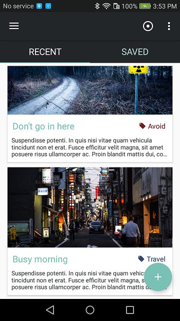
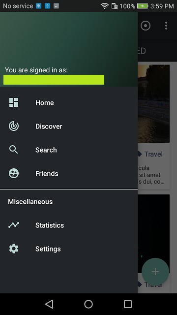
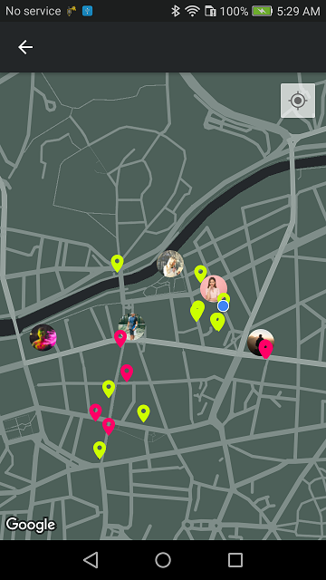

# mapper
Android location-based crowdsourcing application.

### Architecure
#### Model-View-Controller
* **model** - the data layer, responsible for managing the business logic and handling network and Firebase api
* **view** - the view layer, a visualisation of the data from the model
* **controller** - the logic layer, bound to views and updates the model as needed

#### Background services
* `BaseService` which is abstract, provides progress identifier interface and notification provider
* `CloudDownloadService` for uploading images/videos to Firebase cloud storage
* `CloudUploadService` for downloading videos from Firebase since api doesn't provide streaming
* `LocationService` for location-awareness features such as updating db and notifying user about others nearby
* `BluetoothReceiverService` for separately threaded Bluetooth receiver

#### Firebase backend
Consist of `realtime database` for managing user data. User data is bound to all authenticated users and includes attributes such as an email address and other less relevant data. Besides user data `markers`, `vistedMarkers` and `savedMarkers` are managed in separate nodes. Social managment like `friends` and incoming `requests` are also handled here. All image/video data is separated from this database and stored in `firebase cloud storage`, relevant uri information is stored in nodes. Model described previously wraps all logic and provides attachable listeners to other view-controller components.

   

## Installation
Clone this repository and import into **Android Studio**
```bash
git clone https://github.com/dusandjovanovic/mapper.git
```

## Configuration
### Keystores:
Create `app/keystore.gradle` with the following info:
```gradle
ext.key_alias='...'
ext.key_password='...'
ext.store_password='...'
```
And place both keystores under `app/keystores/` directory:
- `playstore.keystore`
- `stage.keystore`


## Build variants
Use the Android Studio *Build Variants* button to choose between **production** and **staging** flavors combined with debug and release build types


## Generating signed APK
From Android Studio:
1. ***Build*** menu
2. ***Generate Signed APK...***
3. Fill in the keystore information *(you only need to do this once manually and then let Android Studio remember it)*

